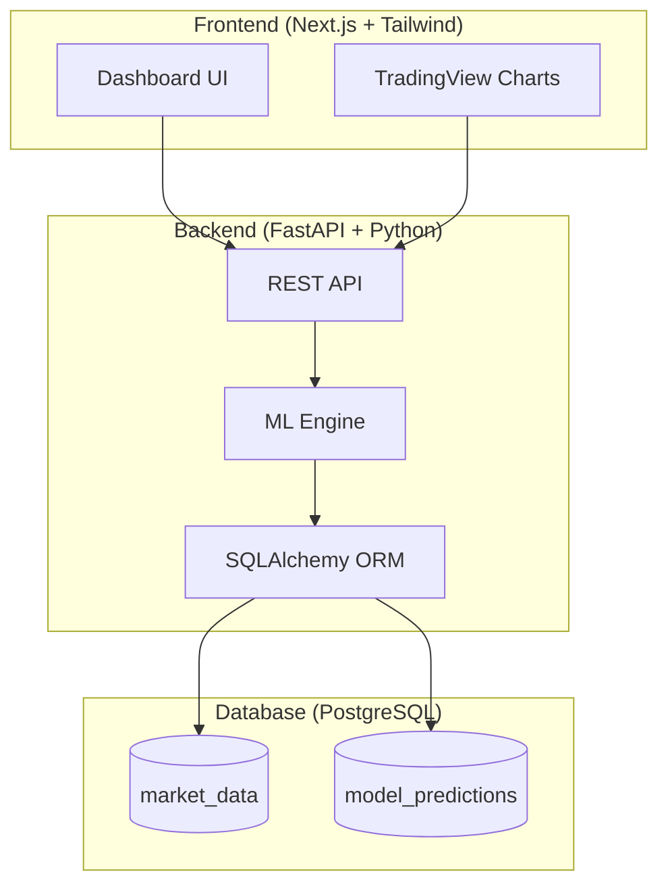

# Algorithmic Market Analyzer & Trade Classifier

A full-stack quantitative analysis platform that uses **Random Forest classification** on engineered statistical indicators (SMA, EMA, RSI, Bollinger Bands) to generate buy/sell signals for Indian equities.

## Architecture



## Tech Stack

| Layer      | Technology                                      |
|------------|------------------------------------------------|
| Frontend   | Next.js 15, TypeScript, Tailwind CSS v4         |
| Charting   | TradingView Lightweight Charts                  |
| Backend    | FastAPI, Python 3.9+, scikit-learn              |
| Database   | PostgreSQL 16 (Docker) / SQLite (local dev)     |
| ORM        | SQLAlchemy 2.x                                  |
| ML Model   | Random Forest Classifier (200 trees)            |
| Deployment | Docker Compose, AWS EC2 + RDS                   |

## Quick Start (Local Development)

### 1. Backend

```bash
cd backend
pip3 install -r requirements.txt
python3 -m uvicorn app.main:app --reload --port 8000
```

The API will be available at `http://localhost:8000`.  
Swagger docs: `http://localhost:8000/docs`

### 2. Frontend

```bash
cd frontend
npm install
npm run dev
```

The dashboard will be available at `http://localhost:3000`.

### 3. Docker (Production)

```bash
docker compose up --build
```

This starts PostgreSQL, the FastAPI backend, and the Next.js frontend.

## API Endpoints

| Method | Endpoint                  | Description                            |
|--------|--------------------------|----------------------------------------|
| POST   | `/api/analyze`           | Full pipeline: fetch → train → backtest|
| GET    | `/api/market-data/{tkr}` | Stored OHLCV + features                |
| GET    | `/api/predictions/{tkr}` | Model predictions + confidence         |
| POST   | `/api/backtest`          | Custom backtest with capital            |
| GET    | `/api/health`            | Health check                           |

## ML Pipeline

1. **Data Acquisition** — 5Y daily OHLCV via Yahoo Finance
2. **Feature Engineering** — SMA (14/50), EMA (14/50), RSI-14, Bollinger Bands
3. **Model Training** — Random Forest with 80/20 time-series split
4. **Backtesting** — ML strategy vs Buy-and-Hold, Sharpe Ratio

## Project Structure

```
banking/
├── backend/
│   ├── app/
│   │   ├── main.py          # FastAPI application
│   │   ├── config.py        # Settings (env vars)
│   │   ├── database.py      # SQLAlchemy connection
│   │   ├── models.py        # ORM models
│   │   ├── schemas.py       # Pydantic schemas
│   │   ├── ml_engine.py     # ML logic
│   │   └── api_routes.py    # REST endpoints
│   ├── requirements.txt
│   └── Dockerfile.backend
├── frontend/
│   ├── src/
│   │   ├── app/             # Next.js pages
│   │   ├── components/      # React components
│   │   └── lib/             # API client
│   └── Dockerfile.frontend
├── docker-compose.yml
├── market_analyzer.py       # Original standalone script
└── README.md
```

## Author

**Ayan Sarkar** — Built for Data Analyst portfolio
